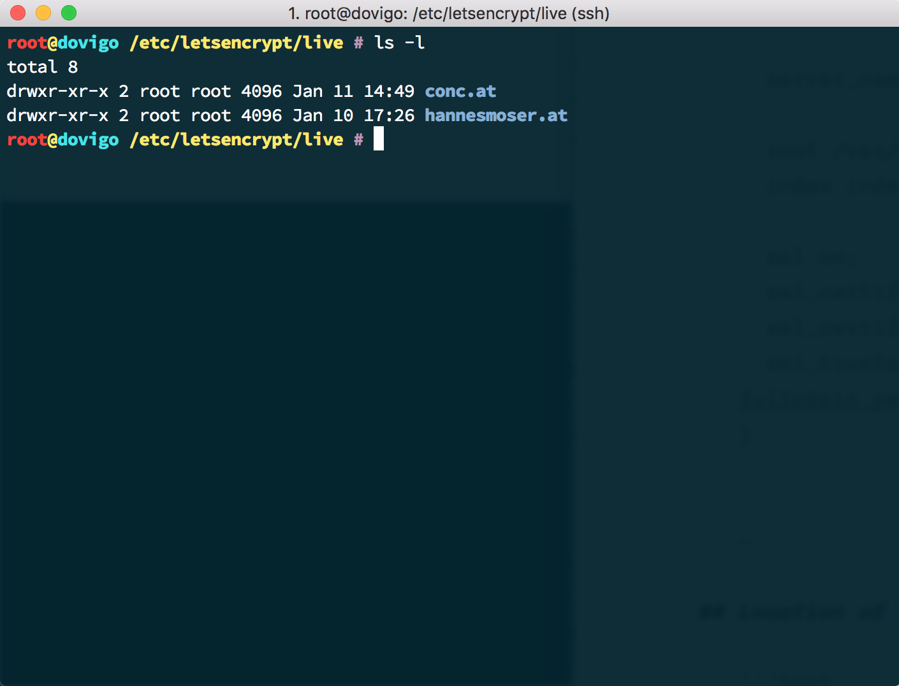
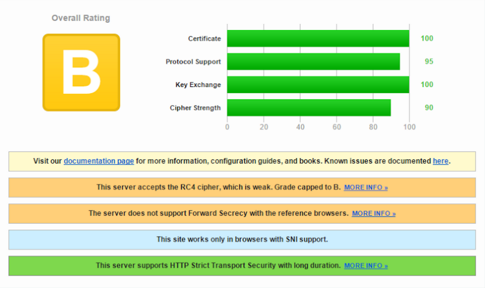
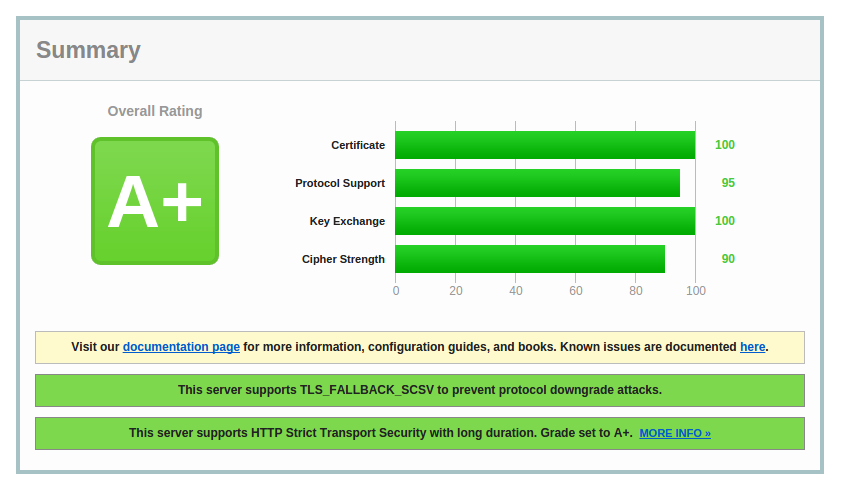

autoscale: true
footer: Hannes Moser – @eliias 2016

# HTTPS Everywhere 🚀

## based on [32C3 What launching a free CA looks like](https://media.ccc.de/v/32c3-7528-let_s_encrypt_--_what_launching_a_free_ca_looks_like)

—

# HTTPS what?

## HTTPS is just HTTP with encryption and authentication.

—

# Encryption

Nobody knows (except you and Netflix) which movie your are watching

—

# Authentication

You can be sure you are watching the movie on Netflix

—

## Why

- Secure communication
- The [Google](https://google.com) bonus
- It is the new default ([HTTP/2](https://tools.ietf.org/html/rfc7540))

—

## It was awful


^ Mann muss Pässe und Heizungsrechnungen schicken

—

## It still is

- Still servers without SNI support
- Missing root certificates on mobile devices
- SSL Hardening
	- [Heartbleed](http://heartbleed.com/)
	- [Logjam](https://weakdh.org/)
	- [FREAK](https://freakattack.com/), [BEAST](https://raymii.org/s/tutorials/Strong_SSL_Security_On_nginx.html#The_BEAST_attack_and_RC4)
	- …

—

## ~~StartSSL~~ [Let’s Encrypt](https://letsencrypt.org/) for the rescue

—

## Let’s Encrypt

### Is a new Certificate Authority. It’s free, automated, and open.

#### In Public Beta
#### Follows ACME specification

—

# ACME
## Automated Certificate Management Environment


—

## Let’s Encrypt – Install

```bash
$ git clone https://git.io/letsencrypt
$ cd ./letsencrypt
$ ./letsencrypt-auto —help
```

—


—

## Let’s Encrypt – Install

You might get a warning/error like this.

```bash
Creating virtual environment…
Updating letsencrypt and virtual environment dependencies…../root/.local/share/letsencrypt/lib/python2.6/site-packages/pip/_vendor/requests/packages/urllib3/util/ssl_.py:90: InsecurePlatformWarning: A true SSLContext object is not available. This prevents urllib3 from configuring SSL appropriately and may cause certain SSL connections to fail. For more information, see https://urllib3.readthedocs.org/en/latest/security.html#insecureplatformwarning.
  InsecurePlatformWarning
Command „python setup.py egg_info“ failed with error code 1 in /tmp/pip-build-TVlyY0/ConfigArgParse
/root/.local/share/letsencrypt/lib/python2.6/site-packages/pip/_vendor/requests/packages/urllib3/util/ssl_.py:90: InsecurePlatformWarning: A true SSLContext object is not available. This prevents urllib3 from configuring SSL appropriately and may cause certain SSL connections to fail. For more information, see https://urllib3.readthedocs.org/en/latest/security.html#insecureplatformwarning.
  InsecurePlatformWarning
```

**Important part**

```bash
A true SSLContext object is not available.
```

**It is strongly recommended to upgrade to a newer Python version!**[^1]

[^1]: https://community.letsencrypt.org/t/insecureplatformwarning-on-ubuntu-14-04-w-python-2-7-6/2871

—

## Let’s Encrypt – Install

```bash
letsencrypt —debug
```

**ATTENTION**
At least Ubuntu 14.04/Debian 7 systems are affected by this error.

[http://urllib3.readthedocs.org/en/latest/security.html#insecureplatformwarning](http://urllib3.readthedocs.org/en/latest/security.html#insecureplatformwarning)

—

## Let’s Encrypt – Install


—

## Let’s Encrypt – Install

These *plugins* are available at the moment:
- Apache
- Standalone
- Webroot

**For nginx and other clients**

```bash
./letsencrypt-auto certonly —webroot -w /www -d abc.xyz -d www.abc.xyz
```

**Checks for this directory in webroot**

```
.well_known
```

—

## Let’s Encrypt – Install

*letsencrypt* will automatically create the directory during certificate creation, but it must be serveable by *nginx*. Just in case it is not working, add the following config to your *server*.

```bash
location /.well-known {
  allow all;
}
```

—

# Server Config

```bash
server {
  listen x.x.x.x:443 ssl;

  server_name abc.xyz;

  root /var/www;
  index index.html;

  ssl on;
  ssl_certificate /etc/letsencrypt/live/abc.xyz/fullchain.pem;
  ssl_certificate_key /etc/letsencrypt/live/abc.xyz/privkey.pem;
  ssl_trusted_certificate /etc/letsencrypt/live/abc.xyz/fullchain.pem;
}
```

—

# Yuchey! 😍


—

# Location of files



—

# Location of files

**Goto directory**

```bash
cd /etc/letsencrypt/live
cd abc.xyz
```

**Check files**

```bash
cert.pem  chain.pem  fullchain.pem  privkey.pem
```

—

# SSL Hardening



—

# SSL Hardening
## Diffie-Hellman

> The Logjam attack allows a man-in-the-middle attacker to downgrade vulnerable TLS connections to 512-bit export-grade cryptography.

**Solution**
Create your own *Diffie-Hellman* parameters

```bash
openssl dhparam -out dhparams.pem 4096
```

```
ssl_dhparam /etc/ssl/certs/dhparam.pem;
```

—

# ~~SSL~~ TLS Hardening

SSL1, SSL2 are bad. Only use the following SSL/TLS versions when possible.

```bash
ssl_protocols TLSv1 TLSv1.1 TLSv1.2;
```

**Do not support outdated or invalid ciphers!**

```bash
ssl_ciphers "…:!aNULL:!eNULL:!EXPORT:!DES:!MD5:!PSK:!RC4";
```

—

# SSL Hardening
## Analyze Loop w/ SSLLabs

[SSLTest](https://www.ssllabs.com/ssltest/)

**Jetzt großes Bild herzeigen!**

—

# SSL Hardening
## Public Key Pinning [HPKP](https://tools.ietf.org/html/rfc7469) 
## or why you should not trust your CA!

[MDN – Public Key Pinning](https://developer.mozilla.org/de/docs/Web/Security/Public_Key_Pinning)

—

# SSL Hardening



—

# Renewal

## Let’s Encrypt certificates will expire after 90 days!

**Renew manually**

```bash
./letsencrypt-auto certonly -a webroot —renew-by-default —config le-renew-webroot.ini
```

—

# Auto renewal

- Will be part of [ACME specification](https://github.com/ietf-wg-acme/acme/blob/master/draft-ietf-acme-acme.md), but not anytime soon!
- Use a script + *cronjob* to renew every **60 days**

```bash
le-renew-webroot
```

```bash
# cli.ini
rsa-key-size = 4096
email = box@conc.at
domains = conc.cat, www.conc.at
webroot-path = /usr/share/nginx/html
```

—

# Auto renewal
## Issues

You need a script and to install **`bc`** on your system.

```bash
apt-get install -y bc
```

**The Script**

```bash
curl -L -o /usr/local/sbin/le-renew-webroot https://goo.gl/QEHVtG
chmod +x /usr/local/sbin/le-renew-webroot
```

**/etc/cron.weekly/le-renewal**

```bash
#!/usr/bin/env bash
le-renew-webroot >> /var/log/le-renewal.log
```

—

# Demo Time

—

# Resources

- [Let’s Encrypt](https://letsencrypt.org/)
- [ACME Spec](https://github.com/letsencrypt/acme-spec)
- [How To `nginx`](https://www.digitalocean.com/community/tutorials/how-to-secure-nginx-with-let-s-encrypt-on-ubuntu-14-04)
- [How To `Apache`](https://www.digitalocean.com/community/tutorials/how-to-secure-apache-with-let-s-encrypt-on-ubuntu-14-04)
- [Example](https://github.com/eliias/letsencrypt)
